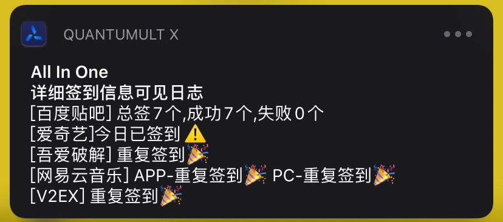

# 多合一Cookie获取+签到

> Cookie脚本会自动检测Cookie是否需要更新，因此您无需手动禁用脚本，一直放着就行
>
> 不太会写说明,见谅...

目前支持的Cookie获取

- 百度贴吧(感谢...我自己)
- 爱奇艺VIP(感谢[@NobyDa](https://github.com/NobyDa))
- 网易云音乐(感谢[@chavyleung](https://github.com/chavyleung))
- 京东(感谢[@NobyDa](https://github.com/NobyDa))
- V2EX(感谢[@chavyleung](https://github.com/chavyleung))
- 吾爱破解(感谢[@NobyDa](https://github.com/NobyDa))
- 微博超话(感谢[@NavePnow](https://github.com/NavePnow/Profiles)) - 此脚本cookie同NavePnow原版相同,请放心食用

目前签到仅`京东`由于需要显示的内容较多,不纳入多合一中,其它的Cookie获取均支持



**Cookie获取脚本:https://github.com/sazs34/TaskConfig/blob/master/all_in/all_in_cookie.js**

**签到脚本:https://github.com/sazs34/TaskConfig/blob/master/all_in/all_in_sign.js**

## Cookie配置

> 这里面的cookie跟[@NobyDa](https://github.com/NobyDa/Script)中的Cookie是通用的


### MITM

此处需要获取Cookie时直接使用即可

使用完注释掉或者直接放着都行，没什么大影响

```
[mitm]
# cookie获取专用,仅获取cookie时使用
hostname = tieba.baidu.com, c.tieba.baidu.com, music.163.com, passport.iqiyi.com, www.52pojie.cn, *.v2ex.com, weibo.com
```
### REWRITE

此处直接放着就好,不需要注释掉

```
[rewrite_local]
# 此处用于京东cookie获取，当失效时需要手动登录京东网页版https://bean.m.jd.com/ 签到获取Cookie, 待QX弹出获取成功即可
https:\/\/api\.m\.jd\.com\/client\.action.*functionId=signBeanIndex url script-request-header all_in_cookie.js
# 此处用于百度贴吧cookie获取，当失效时需手动登录https://tieba.baidu.com/index.html贴吧获取cookie，待弹出获取成功即可
^https?:\/\/tieba.baidu\.com url script-request-header all_in_cookie.js
# APP端直接进去，点击"我的"即可
https?:\/\/c\.tieba\.baidu\.com\/c\/s\/login url script-request-header all_in_cookie.js
# 此处用于网易云音乐cookie获取，当失效时需浏览器访问并登录:https://music.163.com/m/login 获取cookie，待弹出获取成功即可
^https?:\/\/music\.163\.com url script-request-header all_in_cookie.js
# 此处用于爱奇艺cookie获取，加mitm后打开APP，点击“我的”，待弹出获取成功即可
https:\/\/passport\.iqiyi\.com\/apis\/user\/info\.action.*authcookie url script-request-header all_in_cookie.js
# 此处用于52破解cookie获取,浏览器访问https://www.52pojie.cn/home.php?mod=space 即可
https:\/\/www\.52pojie\.cn\/home\.php\?mod=space url script-request-header all_in_cookie.js
# 此处用于V2EX cookie获取，浏览器打开https://www.v2ex.com/mission/daily ，待弹出获取成功即可
^https:\/\/www\.v2ex\.com\/mission\/daily url script-request-header all_in_cookie.js
# 此处用于微博超话 cookie获取,打开超话页,点击'签到'或'已签到',用完后可以注释掉
;https:\/\/weibo\.com\/p\/aj\/general\/button\?ajwvr=6&api=http:\/\/i\.huati\.weibo\.com\/aj\/super\/checkin url script-request-header all_in_cookie.js
# 此处用于强制手机浏览器访问电脑端超话页面,用完后可以注释掉
;^https?://weibo\.com/p/[0-9] url request-header (\r\n)User-Agent:.+(\r\n) request-header $1User-Agent: Mozilla/5.0 (Macintosh; Intel Mac OS X 10_13_6) AppleWebKit/605.1.15 (KHTML, like Gecko) Version/12.0.2 Safari/605.1.15

```

### 触发

|                             名称                             |  方式  |                            说明                            |
| :----------------------------------------------------------: | :----: | :--------------------------------------------------------: |
|                           百度贴吧                           | 浏览器 |             https://tieba.baidu.com/index.html             |
|                           百度贴吧                           |  APP   |                   进入APP,点击"我的"即可                   |
|                            网易云                            | 浏览器 |               https://music.163.com/m/login                |
|                            爱奇艺                            |  APP   |                   进入APP,点击"我的"即可                   |
|                           吾爱破解                           | 浏览器 |         https://www.52pojie.cn/home.php?mod=space          |
|                             V2EX                             | 浏览器 |             https://www.v2ex.com/mission/daily             |
| [微博超话](https://nave.work/%E5%BE%AE%E5%8D%9A%E8%B6%85%E8%AF%9D%E8%87%AA%E5%8A%A8%E7%AD%BE%E5%88%B0%E8%84%9A%E6%9C%AC.html) | 浏览器 | https://weibo.com/p/1008080c5fb650788fe5c7577f0b6ec4a34038 |

微博超话点击即可跳转到对应的详细说明网站上

## 签到脚本

### task配置

```
[task]
0 0 * * * all_in_sign.js
```

### 脚本配置

```javascript
//因为有的人只有其中一个或两个需要进行签到,所以进行了配置化,可以指定签到
const global = {
    log: 1, //日志模式:0不显示 1全部显示 2精简显示
    sign: { //用于设置哪些需要进行签到,哪些不处理
        baidu_tieba: true,
        iqiyi: true,
        _52pojie: true,
        netease_music: true,
        v2ex: true,
        weibo_super: true
    },
    data: {
        //此处用于放置微博超话的信息
        weibo_super: [
            ["周杰伦", "1008087a8941058aaf4df5147042ce104568da"],
            ["IU", "100808d4151ccebfbae55e8f7c0f68f6d18e4d"],
            ["SWITCH", "1008084239f063a3d4fb9d38a0182be6e39e76"],
        ]
    }
}
```

